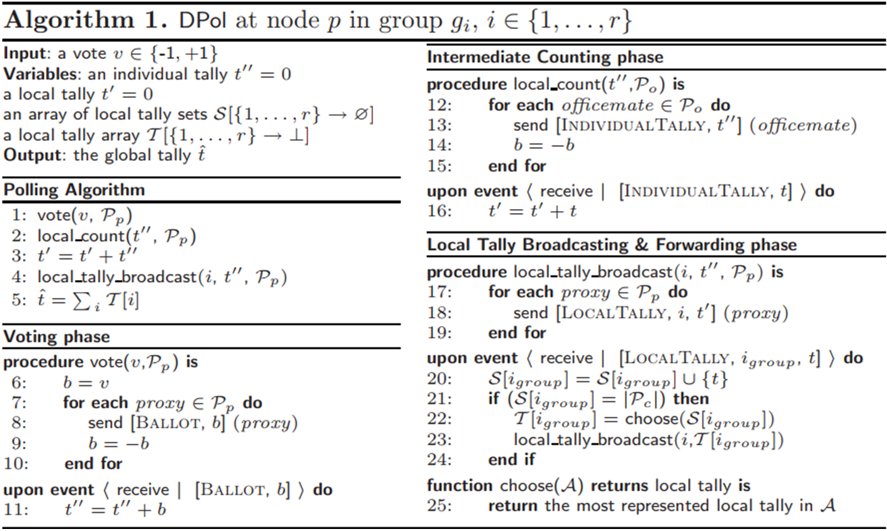

# Implementation of the paper : "Decentralized Polling with Respectable Participants" (DPol) using Scala

## Description

DPol assumes that within a network we have *N* unique identified nodes representing participants. Each of these nodes *p* could vote for a binary value V_p∈{-1, 1} and the expected output of the algorithm is: $\sum_{p} v_p$. 
The algorithm is composed of three phases: 
1) voting, 
2) counting and 
3) broadcasting. 

During the voting phase, a node generates a set of *ballots* reflecting its opinion and sends each ballot to one of its proxies. In the counting phase, each node in a group computes the sum of the votes of the nodes in the previous group (local tally). This is achieved by having each proxy summing up the ballots it has received and broadcasting the result to its officemates. Finally, the local tallies are forwarded along the ring so that all nodes eventually compute the outcome.
The original pseudo code as described in [1] is as follows:

## Implementation

One possible implementation of the algorithm is to use Object Oriented Paradigm by implementing two classes, **Network** class and **Node** class as described in the following diagram:

In the **Node** class, we define the important features of our nodes based on the requirements of the algorithm. The **Network** node defines the main operations and attributes that we need to run the algorithm. Logically a Network must contains several nodes which explains the cardinality **(1..\*)** (node side) and a node could not belongs to more than one network. In addition, each node have a list of “officemates” -the set of the other neighbor nodes within the same group (or Cluster) - and other list of “proxies”--the set of the **2*K+1** nodes within the next group-.

## References

[1] : Guerraoui .R, Huguenin .K, Kermarrec .A-M, Monode .M: Decentralized Polling with Respectable Participants.
